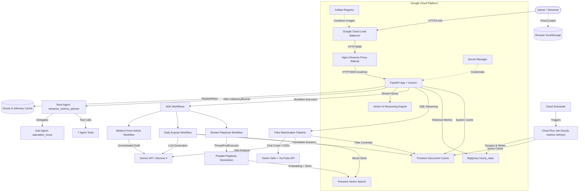
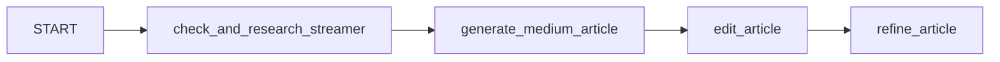
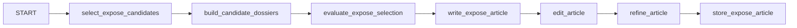
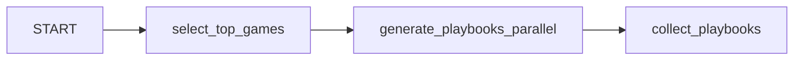
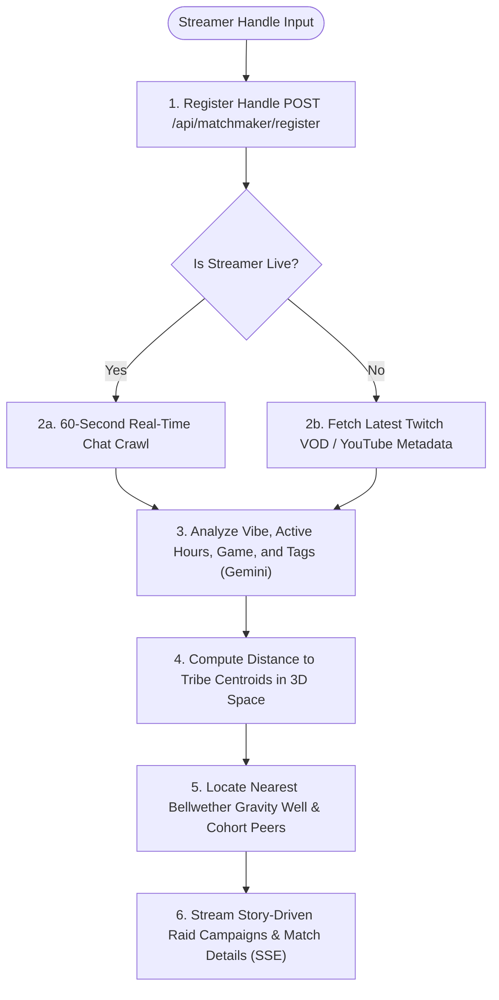
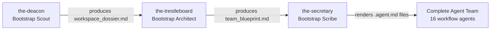
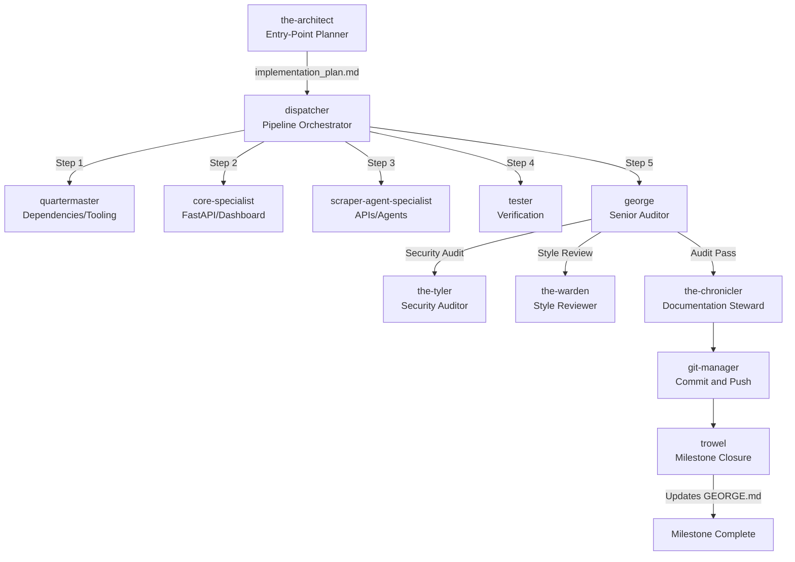
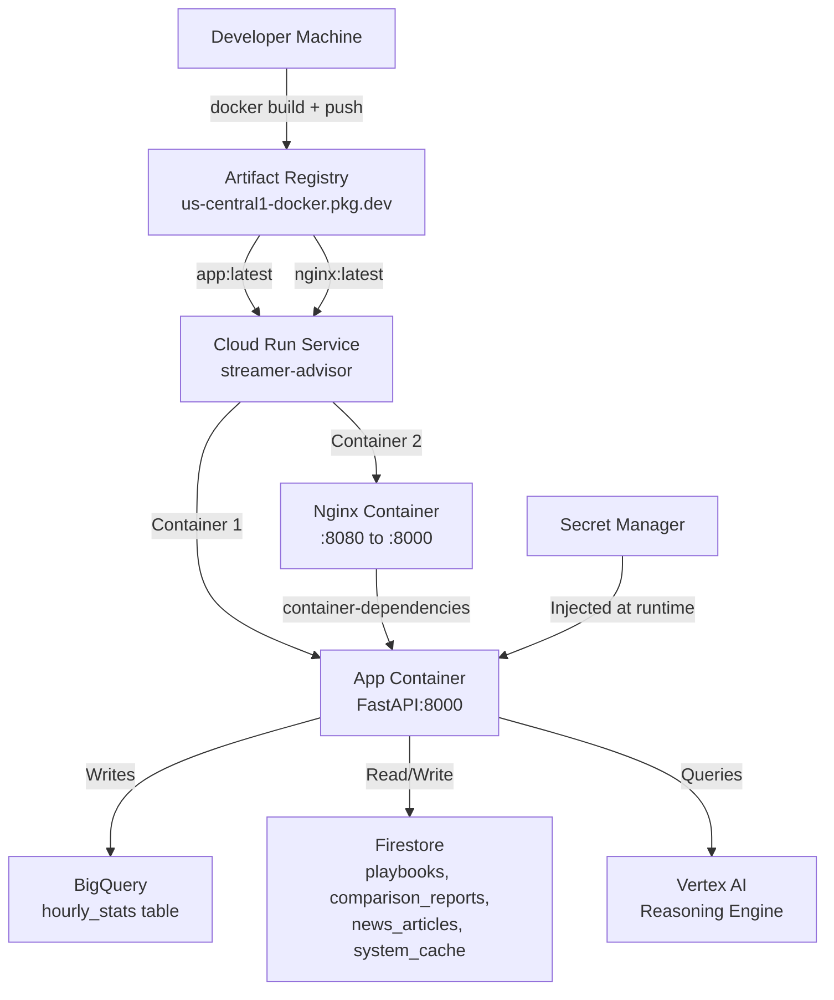

# WOR-ACLE: Streamer Metrics Advisor

> An AI-agent-powered, real-time streaming intelligence platform that helps Twitch and YouTube content creators decide what to stream, when to stream, and how to grow — built with Google ADK, deployed live on Google Cloud Run, and engineered by a self-bootstrapping agentic development team.

**Live Deployment:** [https://streamer-advisor-309218885957.us-central1.run.app/](https://streamer-advisor-309218885957.us-central1.run.app/)
**Track:** Agent Concierge
**Author:** dabe-19 (djmccabe87@gmail.com)

---

## Table of Contents

1. [The Pitch — Problem, Solution, Value](#1-the-pitch--problem-solution-value)
2. [System Architecture Overview](#2-system-architecture-overview)
3. [Agent / Multi-Agent System (ADK)](#3-agent--multi-agent-system-adk)
4. [MCP Servers](#4-mcp-servers)
5. [Antigravity — Agentic Software Development](#5-antigravity--agentic-software-development)
6. [Security Features](#6-security-features)
7. [Deployability](#7-deployability)
8. [Agent Skills](#8-agent-skills)
9. [Data Pipeline & Graceful Degradation](#9-data-pipeline--graceful-degradation)
10. [Setup & Reproduction Instructions](#10-setup--reproduction-instructions)
11. [Future Roadmap](#11-future-roadmap)
12. [Vibe Tribes, Star Map & Tribe Matchmaker](#12-vibe-tribes-star-map--tribe-matchmaker)

---

## 1. The Pitch — Problem, Solution, Value

### Problem Statement

Live streamers face a persistent strategic problem: **deciding what to stream**. The streaming landscape shifts hourly — viewer counts spike and crash, new games trend overnight, and the difference between a 10-viewer and a 10,000-viewer stream often comes down to choosing the right game at the right time for the right audience.

Existing tools provide raw numbers but no *actionable intelligence*. A streamer checking Twitch's browse page sees a list of popular games, but has no way to know:
- Which games have high viewer demand relative to streamer supply (blue-ocean opportunities)
- How their specific channel profile (vibe, scale, stream duration) maps to game audiences
- What the optimal platform split is (Twitch vs. YouTube) for a particular title right now
- What recent news about a game means for streaming opportunity

### Solution

**WOR-ACLE** is an AI concierge agent that transforms raw platform metrics into strategic streaming recommendations. It is not a dashboard that shows numbers — it is an *advisor* that tells you what to do, why, and how to grow. The mission has sharpened from individual advisor to **community connector**: helping micro-streamers discover organic digital communities and forge real audience bonds.

The system operates on two tiers:
1. **Autonomous background intelligence** — An hourly Cloud Run Job (triggered by Cloud Scheduler) scrapes live Twitch Helix and YouTube Data API metrics, writes historical trends to BigQuery, generates comparison reports via Gemini with Google Search grounding, and pre-populates a Firestore vector database with strategic playbooks. The nightly analytics pass also recomputes **Vibe Tribe clusters**, generates LLM-authored tribe names and descriptions, ranks **bellwether** influencers by eigenvector centrality, and writes PCA-projected galaxy coordinates for every profiled streamer.
2. **On-demand concierge interaction** — A retro-arcade-themed chatbot (backed by a Google ADK multi-agent system deployed to Vertex AI Reasoning Engine) answers streamer questions, adds/removes games from the dashboard, generates per-game playbooks, and delegates saturation, profile, and community-ecosystem analysis to specialist sub-agents.

### Community Intelligence: Vibe Tribes, Star Map & Tribe Matchmaker

Beyond individual recommendations, the platform surfaces the hidden topology of the micro-streaming ecosystem:

- **Vibe Tribes** — K-Means clustering over multi-dimensional correlation matrices (chat volatility, rolling sentiment, messages-per-minute) groups streamers into named factions. Each tribe receives a creative, retro-arcade-styled name (e.g. "Neon Intel Nexus", "Midnight Variety Syndicate") and a 1–2-sentence LLM-generated description explaining the shared characteristics. Tribe labels persist across cluster refreshes via Jaccard-similarity matching.
- **Star Map** — An interactive SVG/Canvas visualization renders every Vibe Tribe as a glowing supernode on a PCA-projected galaxy canvas. Clicking a tribe zooms into its individual member stars. Member coordinates are computed per-streamer via PCA applied to correlation feature vectors, so spatial proximity reflects real chat-pattern similarity.
- **Tribe Matchmaker** — On the main dashboard, the **Community Vibe Matchmaker & Orbit Console** accepts any Twitch or YouTube handle, samples live chat, builds a profile (archetype, active time-slot, primary game, vibe tags), locates the closest bellwether gravity well, finds peer micro-streamers orbiting the same cluster centroid, and generates LLM-authored story-driven raid-campaign recommendations for each match.

### Why Agents?

Agents are the right tool because the problem requires **autonomous reasoning over live data, tool orchestration, and delegated specialization**:
- The root agent decides *which tool to call* based on the user's natural language intent (metrics lookup vs. playbook generation vs. market analysis vs. saturation check vs. ecosystem query).
- The saturation scout sub-agent handles a specialized analytical task (viewer-to-streamer ratios) that the root agent delegates to when appropriate.
- The constellation analyst sub-agent handles all Vibe Tribe and ecosystem topology queries — `get_ecosystem_overview`, `get_tribe_details`, `get_bellwether_rankings`.
- ADK Workflows (directed graphs with parallel execution and retry logic) handle the multi-step, multi-API orchestration needed for comparison reports and playbook generation — operations too complex for a single LLM call.
- The automated Cloud Run Job runs agent tasks autonomously without user intervention, maintaining the system's intelligence baseline.

<!-- Screenshots: dashboard, chatbot, playbooks -->

---

## 2. System Architecture Overview



### Key Components

| Component | Technology | Purpose |
|---|---|---|
| **Web Server** | FastAPI + Uvicorn | JSON API endpoints + HTML dashboard serving |
| **Reverse Proxy** | Nginx (Cloud Run sidecar) | TLS termination, security headers, request proxying |
| **AI Agent Runtime** | Google ADK (`google-adk` v2.3+) | Multi-agent orchestration, tool dispatch, workflow execution |
| **Remote Agent** | Vertex AI Reasoning Engine | Cloud-hosted agent execution with streaming response |
| **LLM** | Gemma 4 (`gemma-4-26b-a4b-it`) | Analysis, playbook generation, recommendations |
| **Search Grounding** | Gemini + Google Search Tool | Real-time web-grounded data for reports and news |
| **Embeddings** | `gemini-embedding-001` (768 dims) | Vector similarity for RAG-enhanced recommendations |
| **Vector Database** | Firestore with kNN vector search | Playbook, report, and news article similarity retrieval |
| **Time-Series Storage** | BigQuery (day-partitioned) | Historical hourly metrics with auto-provisioned views |
| **System Cache** | Firestore `system_cache` collection | Cross-restart cache persistence for game data and reports |
| **Client Storage** | Browser `localStorage` | Zero-server-cost playbook pinning and user curation |
| **Platform APIs** | Twitch Helix, YouTube Data API v3 | Real concurrent viewer counts |

---

## 3. Agent / Multi-Agent System (ADK)

### Agent Hierarchy

The production application uses a **multi-level Google ADK agent hierarchy** with 1 root agent, 6 sub-agents, 20 agent tools, 3 ADK Workflow graphs, and 1 Matchmaker pipeline:

```mermaid
graph TD
                    %% --- SYSTEM CLASS CONFIGURATIONS (ZERO LINE-BREAK PARSING ERRORS) ---
                    classDef hmiTitle font-family:inherit,font-size:24px,font-weight:700,fill:#1e293b,stroke:#38bdf8,stroke-width:2.5px,color:#f8fafc,rx:6px,padding:15px;
                    classDef hmiAgent font-family:inherit,font-size:19px,font-weight:700,fill:#111827,stroke:#f43f5e,stroke-width:2.5px,color:#f8fafc,rx:6px,padding:12px;
                    classDef hmiTool font-family:inherit,font-size:16px,font-weight:600,fill:#1e293b,stroke:#475569,stroke-width:1.5px,color:#38bdf8,rx:4px,padding:10px;
                    classDef hmiWorkflow font-family:inherit,font-size:18px,font-weight:700,fill:#4c1d95,stroke:#c084fc,stroke-width:2px,color:#f8fafc,rx:6px,padding:12px;

                    %% Top-Level Application Topology Setup
                    App["ADK App: streamer_metrics_advisor_app"] --> Root["Root Agent: streamer_metrics_advisor_agent"]
                    
                    class App hmiTitle;
                    class Root hmiAgent;

                    %% ------------------------------------------------------------------------
                    %% COLUMN 1 (LEFT): ROOT ENGINE TOOL UTILITIES
                    %% ------------------------------------------------------------------------
                    subgraph RootTools [" [ INVENTORY: ROOT UTILITIES ] "]
                        direction LR
                        T1["get_current_metrics"]
                        T2["get_streamer_comprehensive_dossier"]
                        T3["get_game_specific_advice"]
                        T4["add_custom_game_to_dashboard"]
                        T5["remove_custom_game_from_dashboard"]
                        T6["generate_playbooks_for_current_games"]
                        T7["get_affiliate_gear_recommendation"]
                    end

                    class T1,T2,T3,T4,T5,T6,T7 hmiTool;

                    Root -->|Tool Execution| T1
                    Root -->|Tool Execution| T2
                    Root -->|Tool Execution| T3
                    Root -->|Tool Execution| T4
                    Root -->|Tool Execution| T5
                    Root -->|Tool Execution| T6
                    Root -->|Tool Execution| T7

                    %% ------------------------------------------------------------------------
                    %% COLUMN 2 (RIGHT): SUB-AGENTS PROCESSING ENGINE CORE
                    %% ------------------------------------------------------------------------
                    subgraph SubAgents [" [ SELECT CHIP: SUB-AGENTS ] "]
                        direction LR
                        Scout["Sub-Agent: saturation_scout"]
                        Planner["Sub-Agent: strategy_planner"]
                        Constellation["Sub-Agent: constellation_analyst"]
                        Research["Sub-Agent: streamer_research"]
                        Selector["Sub-Agent: expose_selector"]
                        Writer["Sub-Agent: expose_writer"]
                    end

                    class Scout,Planner,Constellation,Research,Selector,Writer hmiAgent;

                    Root -->|Delegates saturation queries| Scout
                    Root -->|Delegates profile analysis| Planner
                    Root -->|Delegates ecosystem topology| Constellation
                    Root -->|Delegates metadata discovery| Research
                    Root -->|Delegates focus selection| Selector
                    Root -->|Delegates content orchestration| Writer

                    %% Saturation Scout Standalone Target
                    Scout -->|Data Fetch| S1["get_saturation_data"]
                    class S1 hmiTool;

                    %% ------------------------------------------------------------------------
                    %% COLUMN 1 LOWER (LEFT): CONSTELLATION NETWORK TOOL TREES
                    %% ------------------------------------------------------------------------
                    subgraph ConstellationTree [" [ SKILL TREE: CONSTELLATION ANALYST ] "]
                        direction LR
                        C1["get_ecosystem_overview"]
                        C2["get_tribe_details"]
                        C3["get_bellwether_rankings"]
                        C4["get_streamer_correlations"]
                        C5["get_streamer_comprehensive_dossier"]
                    end

                    class C1,C2,C3,C4,C5 hmiTool;

                    Constellation -->|Tool Allocation| C1
                    Constellation -->|Tool Allocation| C2
                    Constellation -->|Tool Allocation| C3
                    Constellation -->|Tool Allocation| C4
                    Constellation -->|Tool Allocation| C5

                    %% ------------------------------------------------------------------------
                    %% COLUMN 2 LOWER (RIGHT): STRATEGY PLANNER METRICS ARRAYS
                    %% ------------------------------------------------------------------------
                    subgraph PlannerTree [" [ SKILL TREE: STRATEGY PLANNER ] "]
                        direction LR
                        P1["get_streamer_comprehensive_dossier"]
                        P2["get_streamer_profile_fabric"]
                        P3["get_similar_streamers"]
                        P4["get_similarity_drift"]
                        P5["get_streamer_correlations"]
                        P6["get_streamer_sentiment_data"]
                        P7["query_streamer_connections"]
                        P8["get_archetype_analytics"]
                        P9["get_game_sentiment_metrics"]
                        P10["get_past_analysis_context"]
                    end

                    class P1,P2,P3,P4,P5,P6,P7,P8,P9,P10 hmiTool;

                    Planner -->|Tool Allocation| P1
                    Planner -->|Tool Allocation| P2
                    Planner -->|Tool Allocation| P3
                    Planner -->|Tool Allocation| P4
                    Planner -->|Tool Allocation| P5
                    Planner -->|Tool Allocation| P6
                    Planner -->|Tool Allocation| P7
                    Planner -->|Tool Allocation| P8
                    Planner -->|Tool Allocation| P9
                    Planner -->|Tool Allocation| P10

                    %% ------------------------------------------------------------------------
                    %% BASEMENT TRACK: DETERMINISTIC COMPUTE WORKFLOWS
                    %% ------------------------------------------------------------------------
                    subgraph BackgroundWorkflows [" [ LEVEL EXECUTION GRAPHS ] "]
                        direction LR
                        MFW["Medium-Form Article Workflow"]
                        DEW["Daily Expose Workflow"]
                        SPW["Stream Playbook Workflow"]
                    end

                    class MFW,DEW,SPW hmiWorkflow;

                    T6 -->|Launches Graph| SPW
                    Planner -->|Launches Graph| MFW
                    Selector -->|Orchestrated by| DEW
                    Writer -->|Orchestrated by| DEW

                    %% --- THE GOLDILOCKS ZONE MATRIX ENGINE MAPPING (BALANCES GRID MATRIX SHAPES) ---
                    %% Left Column Sequencing
                    RootTools ~~~ ConstellationTree
                    
                    %% Right Column Sequencing
                    SubAgents ~~~ PlannerTree
                    
                    %% Centered Basement Core Anchor
                    PlannerTree ~~~ BackgroundWorkflows
```



### Root Agent: `streamer_metrics_advisor_agent`

**Model:** `gemma-4-26b-a4b-it`
**Location:** `src/ag_kaggle_5day/advisor_agent/agent.py`
**Role:** Expert streaming mentor providing real-time, data-driven streaming intelligence.

The root agent is the primary conversational interface. It interprets natural language queries from streamers and dispatches to the appropriate tool or sub-agent. It can:
- Fetch live viewership metrics
- Retrieve comprehensive profile dossiers
- Provide game-specific growth advice (RAG-enhanced with Firestore vector memory)
- Dynamically add/remove games from the tracked dashboard
- Trigger playbook batch generation for scheduled runs
- Recommend streaming gear with real-time pricing via Google Search grounding
- Delegate profile, similarity, and ecosystem analysis to specialized sub-agents

**Initiation points:**
- **Dashboard chatbot** — User sends a message via the retro-arcade chatbot overlay → `POST /api/recommend` → `query_remote_agent()`. End-user requests strictly run locally via `InMemoryRunner` using their personal API key (BYOK) to protect the server's cloud quota. If the model is a Gemma 4 variant, it is wrapped in ADK's `Gemini` API wrapper to bypass registry parsing errors, and transient 500 API errors are mitigated via a global SDK monkeypatch retry and fallback loop (loaded from `models.json`) at startup.
- **Hourly scheduler** — Production uses **Google Cloud Scheduler** to trigger a **Cloud Run Job** (`hourly-metrics-refresh`) that executes the `cron-refresh` CLI command concurrently in parallel (`asyncio.gather`) to completion. Locally, the system defaults to keeping the internal async background scheduler (`run_periodic_agent_scheduler()`) active in the FastAPI startup lifespan for development convenience.

### Sub-Agents (6)

| Sub-Agent | Model | Hand-off Trigger | Tools |
|---|---|---|---|
| **saturation_scout** | `gemma-4-26b-a4b-it` | Market saturation, competition levels, viewer-to-streamer ratios | `get_saturation_data` |
| **strategy_planner** | `gemma-4-26b-a4b-it` | Streamer profiles, archetypes, peer similarity, connections, drift trends | 10 tools (dossier, fabric, similarity, correlations, sentiment, connections, archetypes, game metrics, past context) |
| **constellation_analyst** | `gemma-4-26b-a4b-it` | Vibe Tribes, community clusters, bellwether influence, ecosystem topology, convergence velocity | 5 tools (ecosystem overview, tribe details, bellwether rankings, correlations, dossier) |
| **streamer_research** | `gemma-4-26b-a4b-it` | Real-time searches and Twitch Helix metadata collection for candidate streamers | Research coordination |
| **expose_selector** | `gemma-4-26b-a4b-it` | Evaluates candidate dossiers and selects the Streamer of the Day | Profile evaluation |
| **expose_writer** | `gemma-4-26b-a4b-it` | Writes long-form strategic exposé articles on selected streamers | Content generation |

### Agent Tools Reference (19 tools)

| Tool | Agent(s) | Purpose | Data Source |
|---|---|---|---|
| `get_current_metrics` | Root | Returns live game metrics from cache | In-memory `_HourlyCacheStore` |
| `get_market_analysis_report` | Root | Generates comparative HTML report | Executes `comparative_report_workflow` |
| `get_game_specific_advice` | Root | RAG-enhanced strategic advice | Gemini + Firestore vector search |
| `add_custom_game_to_dashboard` | Root | Scrapes and adds a game to tracking | Twitch/YouTube APIs + `cache.json` |
| `remove_custom_game_from_dashboard` | Root | Removes a custom game from tracking | `cache.json` with `FileLock` |
| `generate_playbooks_for_current_games` | Root | Batch generates and stores playbooks | Gemini + Firestore vector store |
| `get_affiliate_gear_recommendation` | Root | Recommends streaming gear with prices | Gemini Search Grounding + Firestore |
| `get_saturation_data` | Scout | Computes viewer-to-streamer ratios | Twitch Helix `streams` endpoint |
| `get_streamer_sentiment_data` | Root | Samples, deduplicates, and summarizes chat sentiment | Twitch IRC / YouTube Chat + Gemini subagent |
| `get_streamer_profile_fabric` | Planner | Retrieves archetype, activity patterns, peer connections | Firestore `streamer_profiles` |
| `query_streamer_connections` | Planner | Queries channels by archetype, time slot, or game | Firestore `streamer_profiles` |
| `get_archetype_analytics` | Planner | Aggregate metrics grouped by streamer archetype | BigQuery + Firestore |
| `get_game_sentiment_metrics` | Planner | Sentiment and chat speed metrics per game | BigQuery + Firestore |
| `get_similar_streamers` | Planner | Finds and explains similar channels | NVAR similarity engine |
| `get_similarity_drift` | Planner | Historical similarity trajectory between two streamers | BigQuery `streamer_similarity_history` |
| `get_streamer_correlations` | Planner, Constellation | Pairwise correlation and covariance analysis | BigQuery correlation matrices |
| `get_streamer_comprehensive_dossier` | Planner, Constellation | Full dossier: profile + peers + drift trends | Composite aggregation |
| `get_ecosystem_overview` | Constellation | Vibe Tribe summaries, bellwether influencers, convergence signals | Network topology engine |
| `get_tribe_details` | Constellation | Cluster members, archetype distribution, internal convergence | Community clustering |
| `get_bellwether_rankings` | Constellation | Eigenvector centrality rankings across all streamers | Graph centrality analysis |
| `get_past_analysis_context` | Planner | kNN vector search across playbooks, reports, news | Firestore vector search |

### ADK Workflows

Three directed-graph workflows handle multi-step operations that require parallel execution, state validation, and structured content orchestration:

#### Medium-Form Article (Spotlight) Workflow

**Location:** `src/ag_kaggle_5day/advisor_agent/workflows.py`



**Nodes:**
1. `check_and_research_streamer` — Retrieves streamer metrics, checks live chat history, and compiles peer cohort profiles for context.
2. `generate_medium_article` — Uses Gemini to draft a creative spotlight article highlighting the streamer's vibe, archetypes, and community metrics.
3. `edit_article` — Formats and structures the article layout to conform to the retro-arcade CRT display specifications.
4. `refine_article` — Polishes and outputs the finalized spotlight article for immediate display in the dashboard chatbot overlay.

#### Daily Expose Workflow

**Location:** `src/ag_kaggle_5day/advisor_agent/workflows.py`



**Nodes:**
1. `select_expose_candidates` — Inspects the streamer correlation matrices to extract a list of potential daily expose candidate handles.
2. `build_candidate_dossiers` — Aggregates real-time metrics and historical logs to construct an in-depth profile dossier for each candidate.
3. `evaluate_expose_selection` — Invokes Gemini to select the single most compelling candidate based on recent activity anomalies and convergence velocity.
4. `write_expose_article` — Generates a comprehensive, long-form expose article detailing the selected streamer's performance metrics and community impact.
5. `edit_article` — Structures the article HTML/markdown layout, integrating clickable streamer handle drawer triggers.
6. `refine_article` — Applies style corrections, ensuring correct badges are added for YouTube/Twitch source nodes.
7. `store_expose_article` — Saves the finalized article to Firestore and indexes it for vector-based RAG search.

#### Stream Playbook Workflow

**Location:** `src/ag_kaggle_5day/advisor_agent/workflows.py`



**Nodes:**
1. `select_top_games` — Scores cached games against the gamer profile (vibe, scale, duration) and selects top matches
2. `generate_playbooks_parallel` — Generates playbooks for all selected games concurrently using `ThreadPoolExecutor` (max 4 workers). Each playbook: queries Firestore for similar past playbooks (RAG), generates via Gemini, computes embeddings via `gemini-embedding-001`, and stores to Firestore. Retry: 3 attempts with exponential backoff.
3. `collect_playbooks` — Collects results and dynamically inserts a generated affiliate playbook at a random index (index >= 2) using Gemini Search Grounding for real-time gear, pricing, and link recommendations, utilizing the preceding game playbooks as source material to ensure content alignment. The affiliate card has no explicit placeholder during generation to prevent viewer pre-filtering.

#### Tribe Matchmaker Pipeline

**Location:** `src/ag_kaggle_5day/agents/advisor/matchmaker.py` — `run_matchmaker_pipeline()`




### Vertex AI Reasoning Engine

The root agent is deployed to **Vertex AI Reasoning Engine** (resource ID: `6689066454307831808` in project `kaggle-webapp`). The FastAPI app queries it via `stream_query_reasoning_engine` for real-time streaming responses. If the remote engine is unreachable, it falls back to a local `InMemoryRunner` execution.

**Location:** `src/ag_kaggle_5day/routes/recommend.py` — `query_remote_agent()`

---

## 4. MCP Servers

### MCP in the Development Workflow (Antigravity IDE)

While the production WOR-ACLE application accesses external data through direct API clients (Twitch Helix, YouTube Data API, Gemini API) rather than through MCP servers, **the development of this project was itself powered by MCP servers** configured in the Antigravity IDE environment. These servers provided the agentic development team with live access to Google Cloud services during the build process:

| MCP Server | Tools Used | Development Purpose |
|---|---|---|
| `chrome-devtools-mcp` | `take_screenshot`, `navigate_page`, `evaluate_script`, `lighthouse_audit` | Browser automation for UI testing and visual verification of dashboard changes |
| `cloudrun` | `list_services`, `deploy_local_folder`, `get_service_log` | Deploying and monitoring the Cloud Run service directly from the IDE |
| `google-developer-knowledge` | `search_documents`, `answer_query` | Searching Google developer documentation during implementation |
| `mdn` | `get-doc`, `search` | Web standards reference during frontend development |
| `vertex-ai-search` | `search`, `conversational_search` | Exploring Vertex AI capabilities for agent deployment |

### Why Direct APIs Instead of MCP in Production?

The decision to use direct API clients in the runtime application rather than MCP servers was deliberate:

1. **Latency** — Twitch Helix and YouTube Data API calls require sub-second responses for real-time dashboard updates. MCP server indirection would add unnecessary overhead for production API calls that are already well-defined.
2. **Credential management** — The BYOK (Bring-Your-Own-Key) architecture requires per-request key injection via HTTP headers. Direct API clients support this natively; MCP server configurations are typically static.
3. **GCP native services** — BigQuery, Firestore, and Secret Manager are accessed via their official Python SDKs (`google-cloud-bigquery`, `google-cloud-firestore`, `google-cloud-aiplatform`), which provide direct, authenticated access through the Cloud Run service account — no MCP proxy needed.

### Suggested Future Feature: MCP-Powered Live Stream Monitor

A compelling future MCP integration for WOR-ACLE would be an **MCP server that wraps the Twitch EventSub WebSocket API** to provide real-time stream event notifications as an MCP resource:

- **Stream start/stop events** for tracked games could trigger automatic dashboard updates and playbook regeneration without polling
- **Chat activity metrics** from Twitch IRC could feed into the saturation analysis as an "engagement density" signal
- **Raid/host events** could inform the agent about community dynamics in real-time

This would transform the hourly scraping model into a true event-driven architecture, with MCP serving as the standardized protocol layer between the real-time platform events and the ADK agent's tool ecosystem.

---

## 5. Antigravity — Agentic Software Development

> This section documents the most significant engineering contribution of this project: a **self-bootstrapping, hierarchical agentic software development system** built on top of Google's Antigravity IDE, designed to make vibe-coding work at production scale.

### The Two Hierarchies

This project demonstrates two distinct and separate agent hierarchies that coexist in the same repository:

| Hierarchy | Purpose | Where It Lives | When It Runs |
|---|---|---|---|
| **Development Agents** | Build, test, audit, and document the software | `.agents/workflows/`, `.agents/skills/`, `.agents/rules/` | During development, inside Antigravity IDE |
| **Production Agents** | Serve users with real-time streaming intelligence | `src/ag_kaggle_5day/advisor_agent/`, `src/ag_kaggle_5day/agents/` | At runtime, inside the deployed Cloud Run container |

This demarcation is a core principle: the development agent team is not the production agent team. They have different responsibilities, different tool grants, different security boundaries, and different lifecycle hooks. The development agents are *craftsmen* — they write, test, and verify code. The production agents are *advisors* — they serve end-users with data-driven intelligence.

### The Bootstrap Sequence

Every project begins with two artifacts: the `make_py_project.sh` bootstrapping script and a raw `.agents/` directory containing three bootstrap agents and their templates.

#### Step 1: Project Scaffolding

`make_py_project.sh` creates the Poetry project structure:
- Creates `src/<package_name>/` layout with `__init__.py` and `main.py`
- Initializes `pyproject.toml` with Poetry build system
- Sets up `tests/` directory with initial test template
- Configures `.gitignore` with Python defaults
- Sets local pyenv version

#### Step 2: The Bootstrap Trio

Three agents execute in sequence to assess the workspace and design the development team:



**the-deacon** (`.agents/workflows/the-deacon.agent.md`)
Inspects the workspace and produces a comprehensive dossier with: platform context, build commands, file paths, tool inventory, layer map, risk surface, and existing roster. Output: `memories/session/workspace_dossier.md`

**the-trestleboard** (`.agents/workflows/the-trestleboard.agent.md`)
Reads the dossier and designs the full multi-agent team blueprint: which canonical agents to include, which project-specific layer specialists to create, placeholder resolutions, pipeline ordering, and cross-cutting wiring. Output: `memories/session/team_blueprint.md`

**the-secretary** (`.agents/workflows/the-secretary.agent.md`)
Renders the final `.agent.md` files by substituting placeholders from the blueprint into the canonical templates. Verifies zero `{{` tokens remain after substitution.

### The Lodge-Style Development Pipeline

After bootstrapping, a 16-agent development team operates in a fixed-order pipeline for every feature:



### Canonical Core Agents (10)

| Agent | Role | Key Responsibility |
|---|---|---|
| **the-architect** | Entry-point planner | Researches features, drafts `implementation_plan.md` |
| **dispatcher** | Pipeline orchestrator | Routes to specialists in fixed order, runs build gates |
| **quartermaster** | Dev environment steward | Packages, lockfiles, SDK versions, bootstrap scripts |
| **tester** | Verification harness | Runs `poetry run pytest`, read-only on codebase |
| **george** | Senior auditor | Invokes tyler (security) and warden (style), issues Pass/Fail |
| **the-tyler** | Security auditor | Cross-cutting read-only security and prompt-injection review |
| **the-warden** | Style reviewer | Owns `STYLE_GUIDE.md`, enforces coding conventions |
| **the-chronicler** | Documentation steward | Updates `README.md`, docs, architecture docs, GEORGE.md agents section |
| **git-manager** | Version control | Conventional commits, pushes to feature branch (never main) |
| **trowel** | Terminal node | Marks milestone complete in `GEORGE.md`, severs workflow loop |

### Project-Specific Layer Specialists (3)

| Agent | Owned Paths | Test Command |
|---|---|---|
| **core-specialist** | `src/ag_kaggle_5day/` (excluding `agents/`) | `poetry run pytest tests/test_main.py` |
| **scraper-agent-specialist** | `src/ag_kaggle_5day/agents/` | `poetry run pytest src/ag_kaggle_5day/agents/test_agents.py` |
| **frontend-specialist** | `src/ag_kaggle_5day/dashboard.html` | Visual verification via chrome-devtools-mcp |

### Agent Workflow Templates

The canonical templates live in `.agents/workflow_templates/` and use a placeholder vocabulary for project-agnostic reuse:

| Placeholder | This Project's Resolution |
|---|---|
| `{{PROJECT_NAME}}` | `ag-kaggle-5day` |
| `{{PRIMARY_LANGUAGE}}` | Python |
| `{{BUILD_CMD}}` | `poetry run start` |
| `{{TEST_CMD}}` | `poetry run pytest` |
| `{{STATUS_FILE_PATH}}` | `GEORGE.md` |
| `{{STYLE_GUIDE_PATH}}` | `STYLE_GUIDE.md` |
| `{{PIPELINE_ORDER}}` | quartermaster → core-specialist → scraper-agent-specialist → tester → george |
| `{{DESTRUCTIVE_SCRIPTS_BLACKLIST}}` | `make_py_project.sh` |

### Development Skills Library

| Skill | Purpose |
|---|---|
| **caveman** | Ultra-compressed communication mode cutting ~75% token usage |
| **tdd** | Red-green-refactor test-driven development loop |
| **grill-me** | Socratic cross-examination of plans and designs |
| **grill-with-docs** | Plan stress-testing against domain model with inline doc updates |

### Development Rules Library

Rules are organized by domain under `.agents/rules/`: `architecture/`, `backend/`, `frontend/`, `python/`, `testing/`, `ops/`, `data/`, `docs/`, and language-specific directories (`go/`, `rust/`, `typescript/`, `cpp/`, `csharp/`).

### GEORGE.md and Specialist Reports

`GEORGE.md` serves as the project's living status board:
- **Active Board** — Current in-progress implementation plan
- **The Map** — Canonical paths for code, agents, templates, and tests
- **The Rules** — Canonical build/test commands
- **The Trowel** — Chronological record of every shipped milestone (102+ milestones tracked)
- **Agents** — Complete inventory of the development team

The `memories/session/specialist-reports/` directory contains 114+ timestamped reports from individual agents documenting what they changed, tested, and verified during each milestone — a complete audit trail of the development process.

### Software Phytology Vision

The bootstrapping system and co-located agent team represent the precursor to a broader vision called **"Software Phytology"** or **"Software 2.0"**: a model where an agentic development team lives permanently with the active project, eventually tied into production logging so agents can monitor and respond to software bugs or attacks in real-time — like an immune system. Each deployment becomes a unique, individually-adapted organism, creating resilience in the face of LLM-powered cyber attacks through diversity of implementation rather than monoculture.

<!-- Video: bootstrap sequence walkthrough -->
<!-- Video: feature pipeline walkthrough -->

---

## 6. Security Features

### Security Posture Summary

| Feature | Status | Description |
|---|---|---|
| Nginx reverse proxy with TLS | ✅ Implemented | TLS 1.2/1.3 termination, HSTS, security headers |
| BYOK (Bring-Your-Own-Key) | ✅ Implemented | Users supply their own Gemini API key; server key used only for background tasks |
| Non-root container execution | ✅ Implemented | Docker `USER appuser` drops root privileges |
| GCP Secret Manager | ✅ Implemented | All credentials stored as secrets, injected at runtime |
| Server-side rate limiting | ✅ Implemented | Per-endpoint rate limiters with sliding window |
| API documentation auth | ✅ Implemented | `/docs` and `/redoc` protected by HTTP Basic Auth |
| Agent response sanitization | ✅ Implemented | Strips `<thought>`, `<planning>`, reasoning blocks from LLM output |
| XSS sanitization | ✅ Implemented | HTML entity encoding on user-generated content in dashboard |
| Data quality transparency | ✅ Implemented | Explicit `data_quality` badges show data provenance |
| Multi-stage Docker build | ✅ Implemented | Builder/runtime separation minimizes attack surface |
| Prompt input sanitization | ⏳ Planned | Input cleaning/validation for user queries before LLM processing |
| Content Security Policy | ⏳ Planned | CSP headers for script-src restrictions |

### BYOK Architecture

The Bring-Your-Own-Key design is a deliberate security posture choice. Rather than the traditional model (server holds all keys, users trust the server), WOR-ACLE flips the trust model:

- The **server** stores a Gemini API key via Secret Manager *only* for autonomous background tasks (hourly cache refresh, scheduled playbook generation).
- **Users** provide their own Gemini API key via the dashboard settings panel. This key is securely encrypted on the backend and stored in an `HttpOnly` session cookie (`gemini_session_key`) — it is **never stored server-side or logged**.
- Users who do not provide a key see a read-only dashboard with cached data — no LLM calls are made on their behalf.
- This means the end-user is trusting the developer with their key during transit, but the developer is never holding user keys at rest.

#### Local BYOK Model Routing & API Resiliency

To prevent consuming server quota, all chatbot/agent queries initiated by BYOK sessions are forced to run locally via ADK's `InMemoryRunner`. Two specific adaptations ensure Gemma 4 models run reliably in this environment:

1. **ADK Registry Bypassing:** ADK's internal registry matching regex (`gemma_llm.py`) natively supports model patterns only up to `gemma-3.*`. To execute Gemma 4 models (e.g. `gemma-4-26b-a4b-it` and `gemma-4-31b-it`), the models are explicitly instantiated using the ADK `Gemini(model=...)` API wrapper class, completely bypassing the broken registry mapping.
2. **Transient API Error Mitigation & Fallbacks (SDK Monkeypatch):** Public Google AI Studio developer endpoints for Gemma 4 models can experience high rates of transient `500 INTERNAL` server errors. At application startup (`workflow_init.py`), a global monkeypatch is applied to `google.genai.models.Models.generate_content`, `google.genai.models.AsyncModels.generate_content`, `google.genai._interactions.resources.interactions.InteractionsResource.create`, and `AsyncInteractionsResource.create` to intercept `ServerError` exceptions, retry up to 3 times with exponential backoff, and fall back sequentially through the model chain loaded dynamically from the `default_chain` in `models.json`.


### Nginx Reverse Proxy

Two Nginx configurations are maintained:

**Local Development** (`docker/nginx/nginx.local.conf`):
- Self-signed certificate TLS 1.2/1.3
- HTTP → HTTPS 301 redirect
- HSTS with 1-year max-age
- `X-Frame-Options: SAMEORIGIN`, `X-Content-Type-Options: nosniff`

**Cloud Run Production** (`docker/nginx/nginx.cloudrun.conf`):
- Google's load balancer handles TLS termination upstream
- Nginx runs as HTTP-only sidecar on port 8080
- Proxies to FastAPI on localhost:8000 (shared network namespace)
- Security headers: `X-Frame-Options`, `X-Content-Type-Options`

### Rate Limiting

Server-side rate limiting is implemented via a custom `RateLimiter` class with sliding window per client (identified by IP + API key prefix):

| Endpoint | Limit | Window |
|---|---|---|
| `POST /api/collect` | 1 request | 10 seconds |
| `POST /api/compare` | 1 request | 10 seconds |
| `POST /api/recommend` | 5 requests | 30 seconds |
| `POST /api/playbook` | 3 requests | 30 seconds |
| `GET /api/news` | 5 requests | 30 seconds |

### Secret Management

Production credentials are never stored in environment files or code. The Cloud Run `service.yaml` mounts secrets from GCP Secret Manager:
- `gemini-api-key` → `GEMINI_API_KEY`
- `twitch-client-secret` → `TWITCH_CLIENT_SECRET`
- `youtube-api-key` → `YOUTUBE_API_KEY`
- `docs-username` → `DOCS_USERNAME`
- `docs-password` → `DOCS_PASSWORD`

### Container Security

The `Dockerfile` implements security best practices:
- **Multi-stage build** — Build dependencies (gcc, setuptools) exist only in the builder stage
- **Non-root user** — `USER appuser` drops privileges before CMD
- **IPv4 preference** — Forces IPv4 to prevent IPv6 connection hangs in VPN/Docker networks
- **Minimal base image** — `python:3.14-slim` reduces attack surface

---

## 7. Deployability

WOR-ACLE is deployed live on Google Cloud Platform using a multi-container Cloud Run architecture. This section documents every GCP product used and the full deployment process.

### GCP Products Used

| GCP Product | Purpose |
|---|---|
| **Cloud Run** | Multi-container serverless hosting (FastAPI + Nginx sidecar) |
| **Artifact Registry** | Docker image storage (`streamer-advisor-repo`) |
| **Secret Manager** | Credential storage (5 secrets) |
| **BigQuery** | Historical metrics time-series storage (`streamer_metrics.hourly_stats`) |
| **Firestore** | Vector database (playbooks, reports, news) + system cache |
| **Vertex AI** | Reasoning Engine for remote agent hosting |
| **IAM** | Service account (`streamer-app-sa@kaggle-webapp.iam.gserviceaccount.com`) |

### Deployment Architecture



### Step-by-Step Deployment

Full deployment documentation is maintained in `docs/deployment_guide.md`. Summary:

1. **Authenticate GCP** — `gcloud auth login` and set project
2. **Enable APIs** — Cloud Run, Artifact Registry, Secret Manager
3. **Create Docker Registry** — `gcloud artifacts repositories create streamer-advisor-repo`
4. **Build App Image** — Multi-stage Docker build (`python:3.14-slim`)
5. **Build Nginx Image** — Bakes in `nginx.cloudrun.conf`
6. **Configure Secrets** — Upload Twitch, YouTube, Gemini, docs credentials to Secret Manager
7. **Deploy** — `gcloud run services replace service.yaml` (declarative multi-container config)

### Cloud Run Configuration

Key settings from `service.yaml`:
- **Max scale:** 3 instances
- **Container concurrency:** 80 requests
- **CPU/Memory:** App: 1 vCPU / 1 GiB; Nginx: 1 vCPU / 128 MiB
- **Startup CPU boost:** Enabled for fast cold starts
- **Container dependencies:** Nginx depends on App (waits for app health before serving)
- **Timeout:** 300 seconds (accommodates slow Gemini API calls)

### Caching Strategy

The system implements a multi-tier caching strategy to ensure real (not mock) data is always served, even during failures:

| Tier | Storage | Persistence | Purpose |
|---|---|---|---|
| **L1** | In-memory `_HourlyCacheStore` singleton | Process lifetime | Sub-millisecond dashboard loads |
| **L2** | Local `cache.json` with `FileLock` | Disk (container) | Cross-restart within same revision |
| **L3** | Firestore `system_cache` collection | Permanent (cloud) | Cross-deployment persistence |
| **L4** | `SPONSORED_GAMES` hard-coded constants | Code | Absolute last-resort baseline |

On startup, the app restores from Firestore (L3) → local cache (L2) → seeds from sponsored baseline (L4). This means a fresh deployment with no prior cache still serves meaningful data within seconds.

<!-- Video: deployment walkthrough -->
<!-- Screenshots: Cloud Run console, BigQuery, Firestore -->

---

## 8. Agent Skills

### Production Agent Tools & Skills

The runtime application's agent tools are defined in `src/ag_kaggle_5day/advisor_agent/agent.py`. Each tool wraps a specific capability:

#### `get_current_metrics()`
Returns live game metrics from the in-memory cache. Zero API calls — purely cached data.
**Use case:** "What are the top games right now?"

#### `get_market_analysis_report(custom_games, category)`
Executes the full `comparative_report_workflow` — scrapes metrics, fan-outs to prefetch news and retrieve RAG context, joins, generates report via Gemini with search grounding, stores embeddings.
**Use case:** "Compare these games" or "give me a market analysis."

#### `get_game_specific_advice(query)`
Calls `get_recommendation()` which: (1) embeds the query via `gemini-embedding-001`, (2) retrieves top-3 similar past playbooks from Firestore vector search, (3) injects RAG context into the prompt, (4) queries Gemini with Google Search grounding.
**Use case:** "Should I stream Minecraft or Elden Ring?"

#### `add_custom_game_to_dashboard(game_title)`
Reads existing cache, scrapes metrics for the new game (Twitch + YouTube), triggers background news prefetch, regenerates comparison report, updates `cache.json` under `FileLock`.
**Use case:** "Add Stardew Valley to my dashboard."

#### `remove_custom_game_from_dashboard(game_title)`
Removes the game from `cache.json` under `FileLock`, regenerates comparison report with remaining games.
**Use case:** "Remove Fortnite from tracking."

#### `generate_playbooks_for_current_games(vibe, scale, duration)`
Executes `stream_playbook_workflow` — scores games against profile, generates playbooks in parallel via ThreadPoolExecutor, computes embeddings, stores to Firestore.
**Use case:** Scheduled system tasks and "generate playbooks for a competitive affiliate" queries.

#### `get_past_analysis_context(query)`
Embeds the query, runs kNN cosine-distance vector search across three Firestore collections (`playbooks`, `comparison_reports`, `news_articles`).
**Use case:** Internal RAG context retrieval before generating recommendations.

#### `get_saturation_data()` *(Saturation Scout Sub-Agent)*
For each cached game: queries Twitch Helix for live stream count, computes viewer-to-streamer ratio, classifies as "Blue Ocean" (>100:1), "Moderate" (40-100:1), or "Red Ocean" (<40:1).
**Use case:** "What games have low competition?"

#### `get_streamer_sentiment_data(streamer_handle)`
Captures, cleans, and deduplicates 30 seconds of Twitch live chat messages. Invokes the `chat_summarizer` sub-agent (`gemini-3.5-flash`) to generate a one-sentence vibe summary, resolves Twitch Helix stream metadata, active game category, VOD/channel links, and top 3 live streamers playing that game.
**Use case:** "What is shroud's chat vibe?" or "Analyze Ninja's chat."

### Scraper & Data Skills

| Skill | Function | API |
|---|---|---|
| Trending game discovery | `discover_top_games()` | Twitch Helix `games/top` |
| Live viewer aggregation | `TwitchAPIClient.get_viewers_for_game()` | Twitch Helix `streams` (3-page pagination) |
| YouTube live viewers | `YouTubeAPIClient.get_viewers_for_game()` | YouTube `search.list` + `videos.list` |
| YouTube live stream detection | `get_youtube_channel_live_video_id()` | YouTube `/streams` tab + `/live` page + Search API |
| YouTube live chat scraping | `YouTubeChatScraper` | Zero-quota HTML parsing of `live_chat` endpoint |
| Search-grounded estimation | `safe_generate_content()` | Gemini with `google_search` tool |
| Top streamers lookup | `TwitchAPIClient.get_top_streamers()` | Twitch Helix `streams` (top 3) |
| Category-specific discovery | `TwitchAPIClient.get_top_games_by_category()` | Twitch Helix `games/top` by directory |
| Affiliate setup/gear recommendations | `get_affiliate_playbook()` | Gemini with `google_search` tool + Firestore |
| Twitch chat sampling & deduplication | `sample_live_chat()` / `deduplicate_chat_messages()` | Twitch IRC + Gemini subagent |
| Streamer profile fabric aggregation | `aggregate_streamer_profile()` | Composite Firestore/BigQuery + LLM archetype classification |
| Community clustering (Vibe Tribes) | `compute_vibe_tribes()` | K-Means clustering on correlation matrices |
| Bellwether centrality rankings | `compute_bellwether_rankings()` | Eigenvector centrality on streamer graph |
| Convergence velocity signals | `compute_convergence_velocity()` | Rolling-window correlation drift analysis |
| Streamer similarity (NVAR) | `compute_streamer_similarity()` | Normalized vector auto-regression on metrics |
| Ridge regression forecasting | `generate_forecast()` | scikit-learn Ridge + BigQuery history |

### GCP Storage Skills

| Skill | Function | GCP Service |
|---|---|---|
| Write hourly metrics | `write_metrics_to_bigquery()` | BigQuery `hourly_stats` table |
| Write daily analytics timeseries | `store_daily_streamer_analytics_timeseries()` | BigQuery `daily_analytics` table |
| Create daily summary views | `_create_bigquery_views()` | BigQuery SQL view |
| Store playbook with embedding | `store_playbook_vector()` | Firestore + `gemini-embedding-001` |
| Store report with embedding | `store_comparison_report_vector()` | Firestore + `gemini-embedding-001` |
| Store news with embedding | `store_news_vector()` | Firestore + `gemini-embedding-001` |
| Search similar playbooks | `search_similar_playbooks()` | Firestore kNN vector search |
| Search similar reports | `search_similar_comparison_reports()` | Firestore kNN vector search |
| Search similar news | `search_similar_news()` | Firestore kNN vector search |
| Persist system cache | `store_app_cache_state()` | Firestore `system_cache` collection |
| Retrieve system cache | `get_app_cache_state()` | Firestore `system_cache` collection |
| Store streamer sentiment | `store_streamer_sentiment()` | Firestore & BigQuery (with dynamic schema upgrades) |
| Store sentiment moments | `store_streamer_sentiment_moment()` | Firestore `streamer_sentiment_moments` |
| Store streamer profile fabric | `store_streamer_profile_fabric()` | Firestore `streamer_profiles` + BigQuery |
| Retrieve historical sentiment | `get_historical_sentiment_summary()` | Firestore `streamer_sentiment_history` collection |
| Store/retrieve account links | `resolve_streamer_link()` | Firestore `streamer_account_links` |
| Case-preserved YouTube ID healing | `get_case_preserved_youtube_id()` | Firestore + YouTube Search API self-healing |
| Store Vibe Tribe names & descriptions | `streamer_correlation/tribe_names` Firestore document | Persists LLM-generated tribe labels across cluster refreshes |
| Store galaxy + starfield coordinates | `starfield_coordinates` field on `streamer_profiles` | Per-streamer PCA-projected `(x, y, z)` position for Star Map rendering |
| Tribe matchmaker pipeline | `run_matchmaker_pipeline()` | Chat sample → profile → gravity well → peer ranking → SSE raid-campaign stream |

### Observability Skills

| Skill | Function | Purpose |
|---|---|---|
| Structured JSON logging | `JSONFormatter` | Google Cloud Logging compatible output |
| In-memory log buffer | `CircularBufferHandler` (500 entries) | Agentic telemetry and health checks |
| Recent log retrieval | `get_recent_logs(level, limit)` | `/api/admin/logs` endpoint |
| Health telemetry | `get_telemetry_summary()` | Uptime, latency, error counts, status distribution |

---

## 9. Data Pipeline & Graceful Degradation

The data pipeline implements a strict three-tier resolution model. Full documentation is in `docs/data_pipeline.md`.

| Tier | Source | `data_quality` Badge | When Used |
|---|---|---|---|
| **1 (Primary)** | Twitch Helix API + YouTube Data API v3 | `✓ Live Data` | APIs configured and responding |
| **2 (Fallback)** | Gemini + Google Search Grounding | `~ Estimated` | APIs unavailable/unconfigured |
| **3 (Last Resort)** | `SPONSORED_GAMES` hard-coded constants | `✗ No Live Data` | All external calls fail |

**Key design principle:** Random simulation has been completely removed. All viewer counts are either live API data, LLM-synthesised estimates from live search, or unmodified baseline constants. The `data_quality` field is carried on every game dict and surfaced as a badge in the UI so users always know the provenance of the numbers they see.

---

## 10. Setup & Reproduction Instructions

### Prerequisites

- Python 3.14+ (via pyenv recommended)
- Poetry 2.0+
- Docker and Docker Compose (for containerized deployment)
- GCP account with project (for cloud deployment)

### Local Development

```bash
# 1. Clone the repository
git clone https://github.com/dabe-19/ag_kaggle_5day.git
cd ag_kaggle_5day

# 2. Install dependencies
poetry install

# 3. Configure environment
cp .env.example .env
# Edit .env with your API keys:
# GEMINI_API_KEY, TWITCH_CLIENT_ID, TWITCH_CLIENT_SECRET, YOUTUBE_API_KEY

# 4. Run the server
poetry run start
# Open http://localhost:8000
```

### Docker (HTTPS)

```bash
# One-time: generate self-signed certs
./scripts/gen_certs.sh

# Start the full stack
docker compose up --build
# Open https://localhost
```

### Running Tests

```bash
poetry run pytest
```

### Cloud Run Deployment

See `docs/deployment_guide.md` for the full step-by-step guide.

---

## 11. Future Roadmap

| Feature | Priority | Description |
|---|---|---|
| Prompt input sanitization | High | Clean and validate user queries before LLM processing |
| Content Security Policy headers | High | Restrict script-src and style-src |
| MCP EventSub server | Medium | Real-time Twitch stream events via MCP protocol |
| Production agent → logging bridge | Medium | Connect dev agents to production logs for autonomous bug detection |
| YouTube game ID filtering | Low | Heuristic filtering to reduce keyword-match false positives |
| Persistent Twitch token storage | Low | Avoid token re-fetch on cold start |

---

## 12. Vibe Tribes, Star Map & Tribe Matchmaker

This section provides technical depth for the community-intelligence layer described in [§1](#1-the-pitch--problem-solution-value).

### Vibe Tribe Computation

**Location:** `src/ag_kaggle_5day/agents/scraper/correlation.py` — `store_daily_streamer_analytics_timeseries()`

Vibe Tribes are computed during the nightly analytics run, after streamer correlation matrices have been updated:

1. **Feature matrix construction** — Three per-pair Pearson correlation matrices are built (`chat_volatility`, `rolling_sentiment_score`, `msg_per_minute`) and stacked into a single combined feature matrix.
2. **K-Means clustering** — Scikit-learn `KMeans` clusters the feature matrix. Optimal K is selected by silhouette score over a `k=2..8` search.
3. **Tribe labeling** — Each new cluster is Jaccard-matched against cached tribe labels. If overlap ≥ 0.7 the existing name is reused (preserving continuity). Otherwise Gemini generates a creative 2–3-word retro-arcade-styled name plus a 1–2-sentence description explaining the shared characteristics. Both are stored to Firestore `streamer_correlation/tribe_names`.
4. **PCA galaxy coordinates** — Cluster centroids are projected onto 3 principal components by PCA to produce `(x, y, z)` galaxy coordinates. Individual member coordinates are computed similarly from their personal feature vectors.
5. **Bellwether rankings** — Eigenvector centrality is computed on the weighted correlation graph. Scores and tribe memberships are written to `streamer_correlation/current`.

### Star Map: Galaxy View

**UI Location:** ⭐ Star Map tab → `starmap-view` panel in `dashboard.html`
**JavaScript:** `static/js/dashboard.js` — `drawGalaxyView()`, `drawTribeConstellationView()`, `drawStarfieldBackground()`

The Star Map is a two-level interactive SVG/Canvas visualization:

| View | Trigger | What is drawn |
|---|---|---|
| **Galaxy View** | Tab switch or Back button | One glowing supernode per Vibe Tribe, sized by member count, coloured by tribe hue. SVG `<title>` tooltip shows tribe description on hover. |
| **Constellation View** | Click a tribe supernode | Individual member stars in PCA-projected coordinates, connected by relationship lines (if correlation data exists). A side-panel Vibe Tribe chat interface opens automatically. |

A warp-speed canvas animation plays during data loading. Streamers with default `(0, 0, 0)` coordinates (no profiling data yet) are excluded from rendering so uncharted nodes do not bias the layout.

### Tribe Matchmaker & Orbit Console

**UI Location:** Main dashboard tab → `Community Vibe Matchmaker & Orbit Console` glass card
**API Routes:** `routes/matchmaker.py` — `POST /api/matchmaker/register`, `POST /api/matchmaker/recommend`, `GET /api/matchmaker/stream/{handle}`
**Backend Logic:** `agents/advisor/matchmaker.py` — `run_matchmaker_pipeline()`

The Tribe Matchmaker pipeline runs in streaming SSE mode so the UI can show progressive results:

1. **Profile bootstrap** — Twitch Helix metadata is scraped for the submitted handle. Bio, vibe tags, and primary game are merged with any stored profile in Firestore `streamer_profiles`.
2. **Live chat sampling** — 30 seconds of Twitch IRC chat is captured, deduplicated, and summarised into an archetype + activity-time profile.
3. **Gravity well selection** — The bellwether list is read from Firestore. The pipeline finds the closest bellwether by cosine similarity to the user's feature vector.
4. **Peer discovery** — Streamers in the same Vibe Tribe cluster are ranked by activity overlap and vibe-tag similarity.
5. **Raid campaign generation** — For each peer match, Gemini writes a story-driven narrative raid script describing the shared orbital community, delivered as a streaming response to the UI.


Results are rendered as match cards with platform links, vibe-tag badges, and a story-driven raid campaign narrative. The left column of the panel shows an **Ecosystem Radar** with live gravity-well (bellwether) rankings and Vibe Tribe descriptions — no API key required.

---
## Documentation

- [User's Guide](docs/users_guide.md) — How to run and use the application.
- [Deployment Guide](docs/deployment_guide.md) — How to deploy the application to Google Cloud Run.
- [Data Pipeline Reference](docs/data_pipeline.md) — Every external endpoint hit, search performed, and aggregation made.
- [Architectural Vision](docs/architectural_vision.md) — System topology and design philosophy.

---

## Agent Workflows (Development Team)

This project uses a Lodge-style multi-agent team located in `.agents/workflows/`. See [Section 5](#5-antigravity--agentic-software-development) for full documentation.

---

## Project File Structure

```
ag_kaggle_5day/
├── .agents/
│   ├── rules/                    # 13 domain-specific rule directories
│   ├── skills/                   # 4 dev skills (caveman, tdd, grill-me, grill-with-docs)
│   ├── workflow_templates/       # 10 canonical agent templates + README
│   └── workflows/                # 16 rendered agent workflow definitions
├── docker/
│   ├── certs/                    # Self-signed TLS certificates (gitignored)
│   └── nginx/                    # nginx.local.conf, nginx.cloudrun.conf
├── docs/
│   ├── architectural_vision.md
│   ├── data_pipeline.md
│   ├── deployment_guide.md
│   └── users_guide.md
├── memories/session/
│   ├── specialist-reports/       # 60+ timestamped agent reports
│   ├── workspace_dossier.md      # Bootstrap dossier
│   ├── team_blueprint.md         # Agent team design
│   └── implementation_plan.md    # Current plan
├── src/ag_kaggle_5day/
│   ├── advisor_agent/            # ADK agent definitions
│   │   ├── agent.py              # Root agent + 5 sub-agents (constellation_analyst, strategy_planner, saturation_scout, expose_selector/writer, streamer_research)
│   │   └── workflows.py          # 2 ADK Workflow graphs (comparative report, stream playbook)
│   ├── agents/
│   │   ├── advisor/              # Subpackage: cache, reports, similarity, playbooks, matchmaker, etc.
│   │   ├── scraper/              # Subpackage: API clients, discovery, chat, sentinel, correlation, etc.
│   │   └── gcp_storage/          # Subpackage: clients, embeddings, sentiment, profiles, links, etc.
│   ├── routes/                   # FastAPI route handlers (pages, recommendations, news, admin, matchmaker, streamers, etc.)
│   ├── static/                   # Static assets (retro.css, dashboard.js, interactive charts)
│   ├── templates/                # Jinja2 HTML templates (dashboard.html, report partials)
│   ├── app.py                    # Root FastAPI application router assembly (~250 lines)
│   ├── models.py                 # Shared request/response Pydantic models
│   ├── security.py               # Rate limiting, session hashing, encryption helpers
│   └── logging_config.py         # Structured JSON logging pipeline
├── tests/
├── Dockerfile                    # Multi-stage, non-root build
├── Dockerfile.nginx              # Nginx sidecar image
├── docker-compose.yml            # Local HTTPS dev stack
├── docker-compose.cloudrun.yml   # Cloud Run sidecar config
├── service.yaml                  # Declarative Cloud Run deployment
├── GEORGE.md                     # Project status board + agent inventory
├── STYLE_GUIDE.md                # Coding conventions
├── make_py_project.sh            # Project bootstrapping script
├── pyproject.toml                # Poetry project config
└── README.md                     # This file
```
