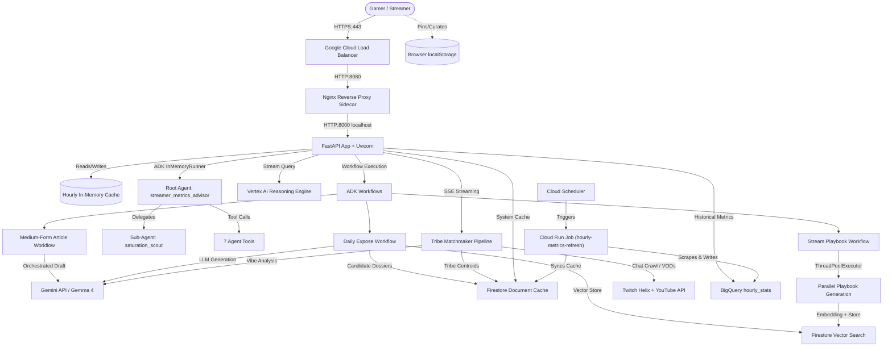

# Architectural Vision: Streamer Metrics Advisor

This document outlines the technical design, system topology, operational principles, and multi-agent development philosophy governing the WOR-ACLE Streamer Metrics Advisor project.

---

## 1. Executive Philosophy

The Streamer Metrics Advisor is engineered to empower content creators with real-time, data-driven streaming intelligence. In a space saturated with generic advice, our platform parses live viewership dynamics, handles API rate-limit limitations gracefully, and uses Google's Gemini/Gemma LLMs to output high-contrast, actionable plans.

The system has evolved from a standalone metrics dashboard into a **Community Connector**: mapping the hidden topology of the streaming ecosystem, grouping creators into vibe-aligned clusters (Vibe Tribes), and providing tools to discover peer collaborators and automate campaign recommendations.

---

## 2. System Topology

The system uses a containerized, HTTPS-first, multi-layered architecture backed by Google Cloud storage and computation engines:

### Key Components:
1. **Nginx Reverse Proxy Sidecar**: Terminating TLS and forwarding clean proxy headers to the FastAPI application.
2. **FastAPI & Uvicorn**: Serving JSON API endpoints, static assets, and HTML templates.
3. **Google Cloud Firestore**:
   * **Document Store**: Holds streamer profiles, cached metrics (`system_cache`), and resolved game genres.
   * **Vector Store**: Performs nearest-neighbor (kNN) vector similarity searches using `gemini-embedding-001` embeddings for Playbooks, News, and Expose articles.
4. **Google Cloud BigQuery**: Day-partitioned analytical database storing historical metrics (`hourly_stats`), chat sentiment history (`sentiment_history`), and daily pairwise similarity snapshots.
5. **Vertex AI Agent Engine (Reasoning Engine)**: Hosts the remote Google ADK multi-agent runtime, with local `InMemoryRunner` fallbacks.
6. **Browser `localStorage`**: Pinning playbooks and curation lists client-side to maintain zero server overhead.

---

## 3. Data Quality & Graceful Degradation Model

To defend against low API limits (especially YouTube v3 quotas) and invalid credentials, the system implements a strict four-tiered fallback model:

| Tier | Source | Quality Status Badge | Description |
|---|---|---|---|
| **Tier 1: Live API** | Twitch Helix & YouTube Data API v3 | `✓ Live Data` | Direct viewer numbers pulled via concurrent viewer endpoints. |
| **Tier 2: LLM Grounding** | Gemini Search Grounding | `~ Estimated` | Search-grounded estimation utilizing current web results. |
| **Tier 3: File Cache** | Local `cache.json` / Firestore | `⏱ Cache: [Age]` | Loads previous successful metrics from disk using `filelock` protection. |
| **Tier 4: Staple Baseline** | Hard-coded `STAPLE_GAMES` | `✗ No Live Data` | Last-resort safety constants to guarantee UI remains functional. |

---

## 4. Multi-Agent & Workflow Architecture

The application coordinates intelligence tasks through a hybrid multi-agent and workflow layout:

* **ADK Root Agent (`streamer_metrics_advisor_agent`)**: Directs intent routing.
* **Specialist Sub-Agents**: 
  * `saturation_scout`: Analyzes supply-to-demand stream metrics.
  * `constellation_analyst`: Interrogates Vibe Tribe cluster topologies and bellwether influencers.
  * `strategy_planner`, `streamer_research`, `expose_selector`, `expose_writer`.
* **ADK Workflows**: Graph-based structures executing multi-step pipelines:
  * **Playbook Planner Workflow**: Evaluates active categories, fetches RAG context, and runs parallel model calls (via `ThreadPoolExecutor`) to generate strategy playbooks.
  * **Daily Expose Workflow**: Automatically selects candidate streamers, parses sentiment logs, generates exposes, and writes to vector storage.
  * **Medium-Form Spotlight Workflow**: Creates community spotlights on demand.

---

## 5. Playbook & Curation Subsystem

The **Stream Playbook Planner & Curation Hub** integrates directly into this architecture:

1. **Scoring Engine**: Evaluates active games from the cache against vibe category maps, saturation thresholds, and session durations.
2. **RAG Context Integration**: Computes embeddings for user requests and queries Firestore vector index to retrieve the top 3 similar historical playbooks as model context.
3. **LLM Generation**: Top matched titles are passed to Gemini/Gemma models with a structured system instruction, preventing generic descriptions and generating actionable platform recommendation splits, interactive audience hooks, and gear advice via Gemini Search Grounding.
4. **Local Curation**: Saves pins to browser local storage, maintaining user privacy and zero server overhead.
