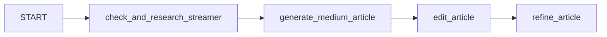
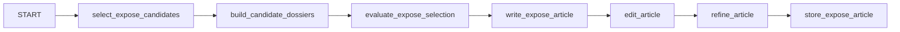
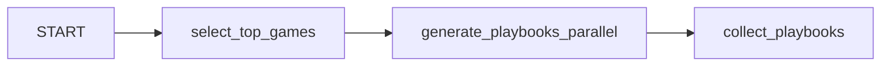
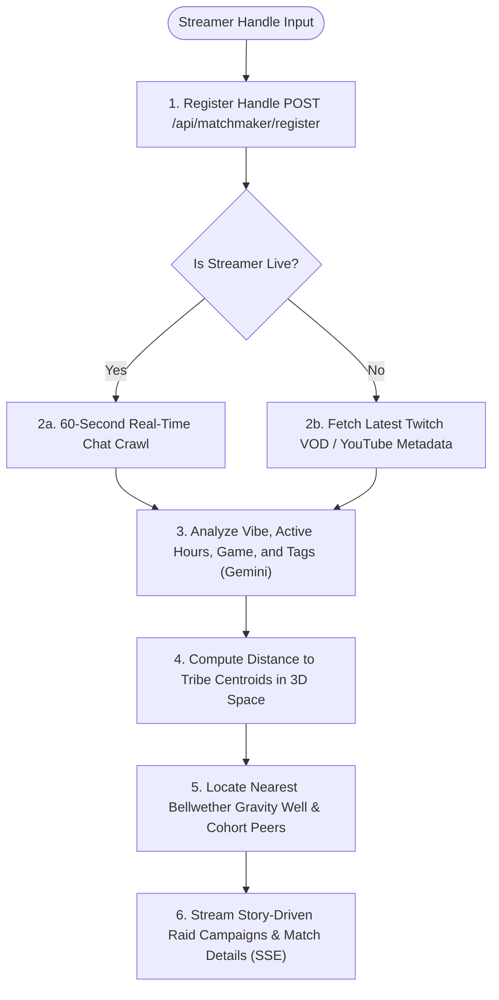

# WOR-ACLE: Streamer Metrics Advisor

**An AI concierge agent that tells live streamers what to play, when to stream, and how to grow — powered by a Google ADK multi-agent system, deployed on Cloud Run, and built by a self-bootstrapping agentic development team.**

**Track:** Agent Concierge
**Live:** [streamer-advisor-309218885957.us-central1.run.app](https://streamer-advisor-309218885957.us-central1.run.app/)
**Full Technical README:** [README.md](https://github.com/dabe-19/ag_kaggle_5day/blob/main/README.md)

---

## The Problem

Streamers face a persistent strategic problem: **deciding what to stream**. The landscape shifts hourly — viewer counts spike and crash, games trend overnight, and the difference between a 10-viewer and a 10,000-viewer stream comes down to choosing the right game at the right time. Existing tools show raw numbers but offer no *actionable intelligence*. Streamers can't easily answer: which games have high demand relative to streamer supply? How does my channel profile map to specific audiences? What does today's gaming news mean for tonight's stream?

For **micro-streamers** — channels under a few hundred viewers — the problem runs deeper. It is not only strategic isolation from real-time data; it is *community isolation*. A micro-streamer with 20 concurrent viewers rarely discovers that 30 other channels share nearly identical chat rhythms, play the same games at the same hours, and orbit the same bellwether influencers. That latent community exists in the data; it simply has no interface to find itself.

## The Solution

WOR-ACLE is an AI concierge that transforms raw platform metrics into strategic recommendations, and — critically — **connects micro-streamers into the organic digital communities that already surround them**.

The system operates on two tiers:

1. **Autonomous background intelligence** — An hourly Cloud Run Job (triggered by Cloud Scheduler) scrapes live Twitch Helix and YouTube Data API metrics, writes historical trends to BigQuery, generates daily exposé articles via Gemini with Google Search grounding, and pre-populates a Firestore vector database with strategic playbooks. The nightly analytics pass also recomputes **Vibe Tribe clusters**, generates LLM-authored tribe names and descriptions, ranks **bellwether** influencers by eigenvector centrality, and writes PCA-projected galaxy coordinates for every profiled streamer.
2. **On-demand concierge interaction** — A retro-arcade chatbot (backed by a Google ADK multi-agent system on Vertex AI Reasoning Engine) answers questions, manages the dashboard, generates playbooks, and delegates saturation, profile, and community-ecosystem analysis to specialist sub-agents.

Agents are the right tool here because the problem requires autonomous reasoning over live data, tool orchestration across multiple APIs, and delegated specialization — not just a single LLM call.

---

## Agent / Multi-Agent System (ADK)

The production application runs a **six-agent Google ADK hierarchy** plus **three ADK Workflow graphs** and a **Tribe Matchmaker pipeline**.

### Root Agent + Sub-Agents

* **Root Agent** (`streamer_metrics_advisor_agent`, model: `gemma-4-26b-a4b-it`) is the primary conversational interface.
* **Saturation Scout** handles viewer-to-streamer ratio analysis, classifying categories as "blue-ocean" (>100:1) vs. "red-ocean" (<40:1).
  * **Hand-off:** On detecting competition/saturation queries, the root delegates entirely to the scout.
* **Strategy Planner** handles streamer profile deep-dives: archetype classification, peer similarity (NVAR), correlation analysis, sentiment trends, connection mapping, and game sentiment metrics across 10 dedicated tools.
* **Constellation Analyst** handles all Vibe Tribe and community-topology queries: ecosystem overview, tribe details, bellwether rankings, and cross-streamer correlations.
* **Streamer Research** coordinates real-time Twitch Helix lookups of candidate streamers for community discovery.
* **Expose Selector / Expose Writer** evaluate candidate dossiers and write long-form strategic exposé articles on the Streamer of the Day spotlight feature.
* **Chat Summarizer** (model: `gemma-4-26b-a4b-it`) processes a 30-second live Twitch chat transcript and generates a one-sentence vibe summary.

### Agent Tools Reference

| Tool | Agent | Purpose | Data Source |
|---|---|---|---|
| `get_current_metrics` | Root | Returns live game metrics from cache | In-memory `_HourlyCacheStore` |
| `get_streamer_comprehensive_dossier` | Root | Retrieves comprehensive profile dossier | Firestore profile + sentiment aggregation |
| `get_game_specific_advice` | Root | RAG-enhanced strategic growth advice | Gemini + Firestore vector search |
| `add_custom_game_to_dashboard` | Root | Adds custom game to dashboard tracking | Twitch/YouTube APIs + `cache.json` |
| `remove_custom_game_from_dashboard` | Root | Removes game from dashboard tracking | `cache.json` with `FileLock` |
| `generate_playbooks_for_current_games` | Root | Batch generates and stores playbooks | Gemini + Firestore vector store |
| `get_past_analysis_context` | Root | Retrieves similar past analyses for RAG | Firestore kNN vector search |
| `get_saturation_data` | Scout | Computes viewer-to-streamer ratios | Twitch Helix `streams` API |
| `get_affiliate_gear_recommendation` | Root | Recommends streaming gear with pricing | Gemini Search Grounding + Firestore |
| `get_streamer_sentiment_data` | Root | Samples and summarizes chat sentiment | Twitch IRC + Gemini summarizer |
| `get_ecosystem_overview` | Constellation | Summary of Vibe Tribes and centrality rankings | Network topology engine |
| `get_tribe_details` | Constellation | Cluster members, archetypes, and descriptions | Firestore `streamer_correlation` |
| `get_bellwether_rankings` | Constellation | Eigenvector centrality influencer rankings | Graph centrality analysis |

### ADK Workflows

**Medium-Form Article (Spotlight) Workflow** (4 nodes): Researches a streamer's platform metadata and chat history, orchestrates a creative draft with peer context, edits for CRT/arcade stylistic tone, and refines the content before presenting it in the Vibe Tribe chat.



**Daily Expose Workflow** (7 nodes): Identifies candidate streamers via correlation metrics, builds comprehensive performance dossiers, evaluates and selects the optimal candidate, writes a detailed long-form expose article using Gemini, performs styling edits/refinements, and persists the finished expose to Firestore vector storage.



**Stream Playbook Workflow** (3 nodes): Scores games against the user's profile (vibe, scale, duration), generates playbooks in parallel via `ThreadPoolExecutor` (4 workers), each with RAG context from similar past playbooks, and collects results while dynamically inserting a generated affiliate playbook at a random index (index >= 2) using Gemini Search Grounding for setup gear and pricing recommendations.



**Tribe Matchmaker Pipeline** (Procedural / SSE Stream): Accepts a Twitch or YouTube handle, samples live chat, builds an activity profile, maps the streamer to Vibe Tribe centroids in 3D coordinate space, and streams story-driven raid campaigns over an SSE event stream.



The root agent is deployed to **Vertex AI Reasoning Engine** for cloud-hosted execution with streaming responses. A **Bring-Your-Own-Key (BYOK) architecture** isolates execution paths:
- **Server Tasks (Cron/Background jobs):** Execute remotely on the Vertex AI Reasoning Engine using the server's GCP service credentials.
- **End-User Interactions (Chatbot/On-demand playbooks):** Execute locally on the FastAPI server instance via `InMemoryRunner`, injecting the user's personal API key.
- **Gemma 4 Support:** Bypasses ADK's internal registry mapping by explicitly instantiating them via the `Gemini` API wrapper class. A global startup monkeypatch catches transient `500 INTERNAL` API overloads, retries requests up to 3 times with exponential backoff, and falls back to subsequent models in the `models.json` default chain.

> Full tool definitions and deployment files: [README §3](https://github.com/dabe-19/ag_kaggle_5day/blob/main/README.md#3-agent--multi-agent-system-adk)

---

## MCP Servers

While production queries utilize direct API clients for sub-second latency and BYOK credential isolation, the development process was powered by **Model Context Protocol (MCP)** servers:
- `chrome-devtools-mcp` (`take_screenshot`, `navigate_page`): Automated browser UI and layout testing.
- `cloudrun` (`list_services`, `deploy_local_folder`): Quick deployment and log inspection directly from the IDE.
- `google-developer-knowledge` (`search_documents`): Streamlined developer reference lookups.
- `mdn` (`get-doc`): Front-end standard lookups during UI coding.
- `vertex-ai-search` (`search`): Explored Vertex AI Reasoning Engine APIs.

An event-driven architecture using an MCP server for Twitch EventSub WebSockets is planned to replace hourly polling with real-time events.

> Full MCP architectural discussion: [README §4](https://github.com/dabe-19/ag_kaggle_5day/blob/main/README.md#4-mcp-servers)

---

## Antigravity — Agentic Software Development

WOR-ACLE was built by two coexisting agent hierarchies: production agents (serving users) and development agents (building the software).

### The Dev Team & Lodge Pipeline
The development team self-assembled from three bootstrap agents: **the-deacon** (Scout: workspace dossier), **the-trestleboard** (Architect: multi-agent team blueprint), and **the-secretary** (Scribe: substituted template placeholders). Every feature flowed through a fixed-order pipeline shipping **45+ milestones** with **60+ timestamped reports** stored in `memories/session/specialist-reports/`.

### Development Agents & Skills
- **the-architect**: Entries plans at `implementation_plan.md` after research.
- **dispatcher**: Pipeline orchestrator and build-gate manager.
- **quartermaster**: Packages, lockfiles, and environment steward.
- **tester**: Read-only test verification runner (`pytest`).
- **george**: Auditor that invokes **the-tyler** (security review) and **the-warden** (style check) for pass/fail audits.
- **the-chronicler** / **git-manager**: Documentation updates and version control commits.
- **trowel**: Marks milestones complete in `GEORGE.md` and halts the workflow loop.
- **Layer Specialists** (**core-specialist**, **scraper-agent-specialist**, **frontend-specialist**): Write feature code and test cases for specific layers.
- **Skills**: **caveman** (compressed chat), **tdd** (test-driven development), and **grill-me** (Socratic plan defense).

*Software Phytology:* Permanent co-located agent teams living within codebases create implementations that are uniquely adapted and resilient.

> Full bootstrap sequence and template system: [README §5](https://github.com/dabe-19/ag_kaggle_5day/blob/main/README.md#5-antigravity--agentic-software-development)

---

## Security Features

| Feature | Status |
|---|---|
| Nginx reverse proxy (TLS 1.2/1.3, HSTS, security headers) | ✅ |
| BYOK — users supply their own Gemini key, never stored server-side | ✅ |
| Non-root container (`USER appuser`) | ✅ |
| GCP Secret Manager (5 secrets, zero env files) | ✅ |
| Per-endpoint rate limiting (sliding window by IP + key prefix) | ✅ |
| API docs auth (HTTP Basic Auth on `/docs`, `/redoc`) | ✅ |
| Agent response sanitization (strips `<thought>`, `<planning>` blocks) | ✅ |
| Multi-stage Docker build (minimal attack surface) | ✅ |

**BYOK** is the core security design: the server holds a key only for autonomous background tasks. Users provide their own key which is encrypted and stored in an `HttpOnly` session cookie (`gemini_session_key`) — it is never persisted. Users without a key see a read-only cached dashboard.

> Full security matrix: [README §6](https://github.com/dabe-19/ag_kaggle_5day/blob/main/README.md#6-security-features)

---

## Deployability

WOR-ACLE is a **production-grade, live-deployed web application** running 24/7 on Google Cloud Platform. The codebase leverages GCP serverless services, resolving credentials and database locations automatically at runtime through Application Default Credentials (ADC) attached to the Cloud Run service account.

### GCP Products Used

| GCP Product | Purpose |
|---|---|
| **Cloud Run** | Multi-container serverless hosting (FastAPI + Nginx sidecar) |
| **Artifact Registry** | Docker image storage |
| **Secret Manager** | Secure credential injection (5 secrets) |
| **BigQuery** | Historical stats (partitioned, auto-provisioned tables/views) |
| **Firestore** | Vector database (playbooks, exposes, news) + system cache |
| **Vertex AI** | Reasoning Engine for remote agent execution |
| **IAM** | Dedicated service account with scoped permissions |

### Summary of Deployment Steps
1. **Initialize APIs**: Authenticate via `gcloud` and enable APIs for Cloud Run, Firestore, BigQuery, and Vertex AI.
2. **Push Docker Images**: Compile and push the backend `app` image and custom `nginx` sidecar proxy to Artifact Registry.
3. **Secrets & Databases**: Add Twitch/Gemini keys to Secret Manager. Initialize Firestore in Native mode.
4. **Provision Tables & Indexes**: Firestore builds vector indexes (`playbooks`, `spotlight_expose_articles`). BigQuery tables auto-provision on first write.
5. **Manifest & Cron**: Deploy the shared network backend container using `service.yaml`. Trigger the scraper Cloud Run Job hourly via Cloud Scheduler.

### 4-Tier Caching
L1 memory cache → L2 local `cache.json` (`FileLock`) → L3 Firestore `system_cache` → L4 sponsored fallback constants.

> Full deployment details: [docs/deployment_guide.md](https://github.com/dabe-19/ag_kaggle_5day/blob/main/docs/deployment_guide.md)

---

## Agent Skills & Data Pipeline

The production system relies on custom data-fetching pipelines, GCP storage, and unified observability.

### Core Data & Storage Skills
- **Game Metrics:** Twitch Helix top games lookup, live stream viewer aggregations, and YouTube Search API viewer parsing.
- **Vibe Tribes:** Nightly K-Means on Pearson correlation matrices (`scikit-learn` KMeans, silhouette score), eigenvector centrality for bellwethers, and 3D PCA projections.
- **Tribe Matchmaker:** Procedural SSE pipeline capturing live chat (Twitch IRC), analyzing streamer vibe via Gemini, and streaming raid scripts.
- **GCP Storage:** BigQuery hourly metrics inserts, `gemini-embedding-001` playbook/exposé indexing, and Firestore kNN vector search.
- **Observability:** Google Cloud JSON logging, 500-entry in-memory log buffer (`CircularBufferHandler`), and `/api/admin/logs` telemetry.
- **Graceful Degradation:** Three metrics tiers: Tier 1 (`✓ Live Data`), Tier 2 (`~ Estimated` via Gemini Search Grounding), and Tier 3 (`✗ No Live Data` sponsored fallback).

---

## Vibe Tribes, Star Map & Tribe Matchmaker

The community-intelligence layer connects micro-streamers into organic digital communities.

### Vibe Tribe Clustering
Computed nightly using K-Means over Pearson correlation matrices (`chat_volatility`, `rolling_sentiment_score`, `msg_per_minute`). Optimal cluster count is selected by silhouette score (k=2..8). Each cluster receives a creative retro-arcade name and a 1–2-sentence description authored by Gemini. Names are re-used when Jaccard overlap ≥ 0.7 to preserve continuity.

### Star Map: Galaxy View
Renders Vibe Tribes as glowing supernodes on a PCA-projected canvas:
- **Galaxy View:** Shows all tribes sized by member count. Hovering reveals the Gemini description.
- **Constellation View:** Clicking a tribe zooms to individual stars with member PCA coordinates. Opens a side-panel Vibe Tribe chat interface powered by `constellation_analyst` sub-agent.
Default `(0, 0, 0)` coordinates are excluded to avoid layout bias.

### Community Vibe Matchmaker & Orbit Console
- **Ecosystem Radar:** Left column showing live bellwether (gravity-well) rankings and tribe descriptions — no API key required.
- **Tribe Matchmaker:** Accepts any Twitch/YouTube handle. Streams results over SSE: scrapes live chat, builds a profile, finds the closest bellwether gravity well, and streams LLM-authored story-driven raid campaigns.

> Full reference: [README §12](https://github.com/dabe-19/ag_kaggle_5day/blob/main/README.md#12-vibe-tribes-star-map--tribe-matchmaker)

---

## Local Setup

```bash
git clone https://github.com/dabe-19/ag_kaggle_5day.git && cd ag_kaggle_5day
poetry install
cp .env.example .env  # Add: GEMINI_API_KEY, TWITCH_CLIENT_ID/SECRET, YOUTUBE_API_KEY
poetry run start      # http://localhost:8000
```

Docker: `./scripts/gen_certs.sh && docker compose up --build` → https://localhost

Tests: `poetry run pytest`
